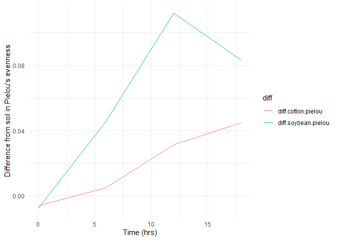

## [Link](https://github.com/Jake-Ramirez/Data_wrangling)

### 1. Download two .csv files from Canvas called DiversityData.csv and Metadata.csv, and read them into R using relative file paths.

``` r
library(tidyverse)
```

    ## Warning: package 'ggplot2' was built under R version 4.5.1

    ## Warning: package 'tibble' was built under R version 4.5.1

    ## Warning: package 'stringr' was built under R version 4.5.2

    ## Warning: package 'forcats' was built under R version 4.5.1

    ## ── Attaching core tidyverse packages ──────────────────────── tidyverse 2.0.0 ──
    ## ✔ dplyr     1.1.4     ✔ readr     2.1.5
    ## ✔ forcats   1.0.1     ✔ stringr   1.6.0
    ## ✔ ggplot2   4.0.0     ✔ tibble    3.3.0
    ## ✔ lubridate 1.9.4     ✔ tidyr     1.3.1
    ## ✔ purrr     1.0.4     
    ## ── Conflicts ────────────────────────────────────────── tidyverse_conflicts() ──
    ## ✖ dplyr::filter() masks stats::filter()
    ## ✖ dplyr::lag()    masks stats::lag()
    ## ℹ Use the conflicted package (<http://conflicted.r-lib.org/>) to force all conflicts to become errors

``` r
Diversity_Data <- read.csv("DiversityData.csv")
Metadata <- read.csv("Metadata.csv")
```

### 2. Join the two dataframes together by the common column ‘Code’. Name the resulting dataframe alpha.

``` r
alpha <- left_join(Diversity_Data, Metadata, by = "Code")
head(alpha)
```

    ##     Code  shannon invsimpson   simpson richness Crop Time_Point Replicate
    ## 1 S01_13 6.624921   210.7279 0.9952545     3319 Soil          0         1
    ## 2 S02_16 6.612413   206.8666 0.9951660     3079 Soil          0         2
    ## 3 S03_19 6.660853   213.0184 0.9953056     3935 Soil          0         3
    ## 4 S04_22 6.660671   204.6908 0.9951146     3922 Soil          0         4
    ## 5 S05_25 6.610965   200.2552 0.9950064     3196 Soil          0         5
    ## 6 S06_28 6.650812   199.3211 0.9949830     3481 Soil          0         6
    ##   Water_Imbibed
    ## 1            na
    ## 2            na
    ## 3            na
    ## 4            na
    ## 5            na
    ## 6            na

### 3. Calculate Pielou’s evenness index: Pielou’s evenness is an ecological parameter calculated by the Shannon diversity index (column Shannon) divided by the log of the richness column.

1.  Using mutate, create a new column to calculate Pielou’s evenness
    index.
2.  Name the resulting dataframe alpha_even.

``` r
alpha_even <- alpha %>%
  group_by(shannon, richness) %>%
  mutate(pielou = shannon/log(richness))
head(alpha_even)
```

    ## # A tibble: 6 × 10
    ## # Groups:   shannon, richness [6]
    ##   Code   shannon invsimpson simpson richness Crop  Time_Point Replicate
    ##   <chr>    <dbl>      <dbl>   <dbl>    <int> <chr>      <int>     <int>
    ## 1 S01_13    6.62       211.   0.995     3319 Soil           0         1
    ## 2 S02_16    6.61       207.   0.995     3079 Soil           0         2
    ## 3 S03_19    6.66       213.   0.995     3935 Soil           0         3
    ## 4 S04_22    6.66       205.   0.995     3922 Soil           0         4
    ## 5 S05_25    6.61       200.   0.995     3196 Soil           0         5
    ## 6 S06_28    6.65       199.   0.995     3481 Soil           0         6
    ## # ℹ 2 more variables: Water_Imbibed <chr>, pielou <dbl>

### 4. Using tidyverse language of functions and the pipe, use the summarise function and tell me the mean and standard error evenness grouped by crop over time.

``` r
alpha_average <- alpha_even %>%
  group_by(Crop, Time_Point) %>%
  summarise(Mean.pielou = mean(pielou), # calculating the mean richness, count, stdeviation, and standard error
            n = n(), 
            sd.dev = sd(pielou)) %>%
  mutate(std.err = sd.dev/sqrt(n))
```

    ## `summarise()` has grouped output by 'Crop'. You can override using the
    ## `.groups` argument.

``` r
head(alpha_average)
```

    ## # A tibble: 6 × 6
    ## # Groups:   Crop [2]
    ##   Crop   Time_Point Mean.pielou     n  sd.dev std.err
    ##   <chr>       <int>       <dbl> <int>   <dbl>   <dbl>
    ## 1 Cotton          0       0.820     6 0.00556 0.00227
    ## 2 Cotton          6       0.805     6 0.00920 0.00376
    ## 3 Cotton         12       0.767     6 0.0157  0.00640
    ## 4 Cotton         18       0.755     5 0.0169  0.00755
    ## 5 Soil            0       0.814     6 0.00765 0.00312
    ## 6 Soil            6       0.810     6 0.00587 0.00240

### 5. Calculate the difference between the soybean column, the soil column, and the difference between the cotton column and the soil column

``` r
alpha_average2 <- alpha_average %>%
  select(Time_Point, Crop, Mean.pielou) %>%
  pivot_wider(names_from = Crop, values_from = Mean.pielou) %>%
  mutate(diff.cotton.pielou = Soil-Cotton, diff.soybean.pielou = Soil-Soybean)
head(alpha_average2)
```

    ## # A tibble: 4 × 6
    ##   Time_Point Cotton  Soil Soybean diff.cotton.pielou diff.soybean.pielou
    ##        <int>  <dbl> <dbl>   <dbl>              <dbl>               <dbl>
    ## 1          0  0.820 0.814   0.822           -0.00602            -0.00740
    ## 2          6  0.805 0.810   0.764            0.00507             0.0459 
    ## 3         12  0.767 0.798   0.687            0.0313              0.112  
    ## 4         18  0.755 0.800   0.716            0.0449              0.0833

### 6. Connecting it to plots

``` r
plot <- alpha_average2 %>%
  select(Time_Point, diff.cotton.pielou, diff.soybean.pielou) %>%
  pivot_longer(c(diff.cotton.pielou, diff.soybean.pielou), names_to = "diff") %>%
  ggplot(aes(x=Time_Point, y=value, color = diff)) +
  geom_line() +
  theme_minimal() +
  xlab("Time (hrs)") +
  ylab("Difference from soil in Pielou's evenness")
print(plot)
```

<!-- -->
